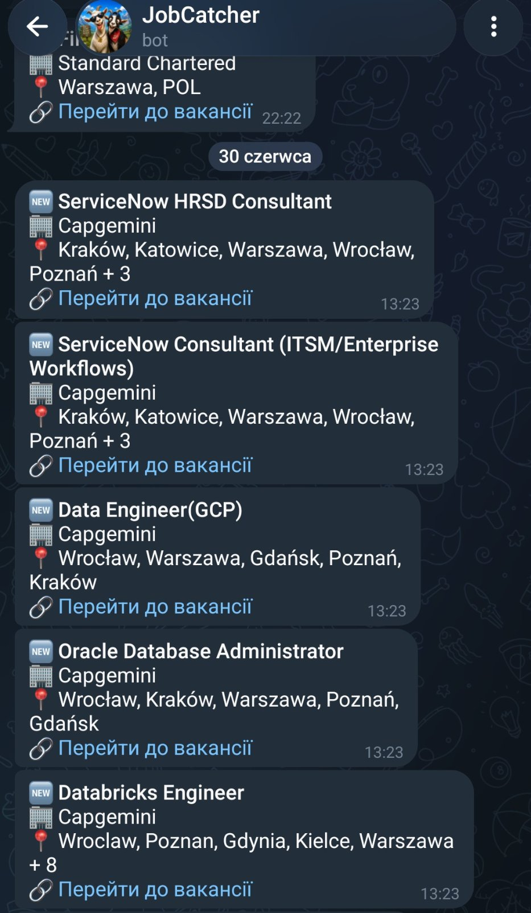

# Job Search Automation

An automated job vacancy scraping pipeline featuring cloud database integration and instant notification dispatch. The system is designed following stateless architecture principles, enabling seamless cloud deployment and scheduled execution.

## Technology Stack

* **Core:** Node.js (ES Modules)
* **Scraping:** Playwright
* **Database:** PostgreSQL (Supabase) with Row Level Security (RLS)
* **Notifications:** Telegram Bot API
* **Infrastructure:** GitHub Actions / Oracle Cloud Infrastructure (Linux VM)

## Project Structure & Architecture

* **`index.js`**
  The primary orchestration module. Manages the Playwright lifecycle, controls isolated browser contexts, iterates over target sites, implements business logic filters, and delegates data persistence and notification tasks to respective modules.

* **`scraper-strategies.js`**
  Implements the Strategy Pattern to encapsulate scraping algorithms. Isolates DOM tree interaction logic for distinct website structures (standard DOM layouts or enterprise platforms like Jibe) and handles anti-scraping overlays such as cookie banners.

* **`db.js`**
  The Data Access Layer. Establishes a stateless connection to the Supabase cloud instance and handles vacancy storage. Implements atomic deduplication directly via the PostgreSQL `upsert` mechanism to prevent duplicate notifications.

* **`notifier.js`**
  The external communication module. Isolates interaction with the Telegram Bot API, performing asynchronous HTTP requests using the native `fetch` API to deliver HTML-formatted vacancy updates. Incorporates Guard Clauses to log misconfigurations instead of crashing the runtime.

* **`env.js`**
  The environment initialization module. Securely parses the `.env` file and injects secrets into the process environment. Operates independently of the Current Working Directory (CWD) to ensure reliability within automated schedulers, relying exclusively on native Node.js modules (`fs`, `path`).

## Configuration & Environment

The application uses `config.json` to declaratively define scraping targets.Secret keys, tokens, and database credentials are strictly isolated within environment variables, with a template available in `.env.example`.

## Sample Notification

When a new vacancy matching the configured filters is found, the bot sends an instant Telegram notification:

